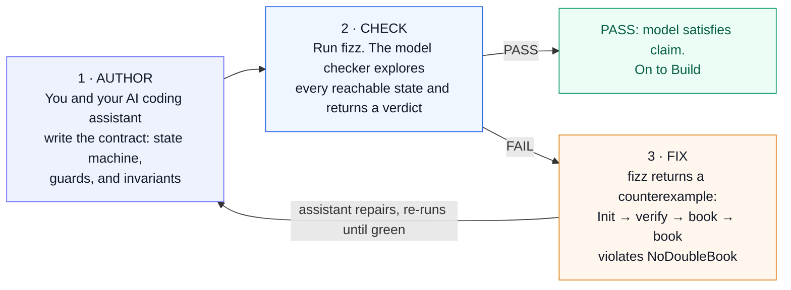

# The Design Loop (Mermaid source)

Renders natively on GitHub. For Medium, export a PNG (e.g. via [mermaid.live](https://mermaid.live)) or use [`design-loop.png`](design-loop.png).

```mermaid
flowchart LR
    A["1 · AUTHOR<br/>You and your AI coding assistant<br/>write the contract: state machine,<br/>guards, and invariants"]
    C["2 · CHECK<br/>Run fizz. The model checker explores<br/>every reachable state and returns a verdict"]
    P["PASS: model satisfies claim.<br/>On to Build"]
    F["3 · FIX<br/>fizz returns a counterexample:<br/>Init → verify → book → book<br/>violates NoDoubleBook"]
    A --> C
    C -->|PASS| P
    C -->|FAIL| F
    F -->|assistant repairs, re-runs until green| A
    classDef author fill:#eef2ff,stroke:#6366f1,color:#111827
    classDef check fill:#eff6ff,stroke:#2563eb,color:#111827
    classDef pass fill:#ecfdf5,stroke:#059669,color:#065f46
    classDef fix fill:#fff7ed,stroke:#d97706,color:#111827
    class A author
    class C check
    class P pass
    class F fix
```
